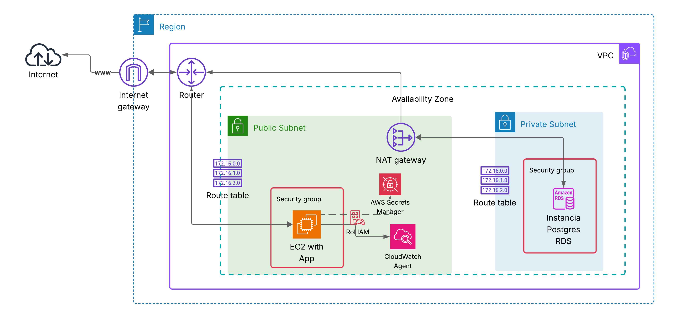

# 🚀 Proyecto RDS + API

Este proyecto despliega una infraestructura completa en **AWS** utilizando **Terraform**, diseñada para ejecutar una aplicación Node.js con **PostgreSQL (RDS)**, gestión segura de credenciales con **Secrets Manager** e integración con **CloudWatch Logs** para observabilidad.

---

## 📌 Arquitectura



**Componentes principales:**

- **VPC**
  - Subred pública (EC2 + NAT Gateway).
  - Subredes privadas (RDS).
  - Internet Gateway + NAT Gateway.
  - Tablas de ruteo públicas y privadas.

- **EC2**
  - Instancia en subred pública.
  - Perfil IAM con permisos para **Secrets Manager** y **CloudWatch**.
  - Despliega aplicación Node.js vía `setup.sh`.
  - Logs gestionados con **PM2** y enviados a CloudWatch.

- **RDS PostgreSQL**
  - Instancia privada.
  - Acceso restringido solo desde la VPC.
  - Grupo de subredes privadas.

- **Secrets Manager**
  - Almacena credenciales de la base de datos.
  - Accesible únicamente por la instancia EC2.

- **CloudWatch**
  - Grupo de logs y streams personalizados.
  - Logs de aplicación (`out` y `error`) recolectados por el **CloudWatch Agent**.

---

## 📂 Estructura del proyecto
terraform-projects/
│── modules/
│ ├── vpc/ # VPC, subredes, IGW, NAT, tablas de ruteo
│ ├── ec2/ # EC2 + IAM Role + Instance Profile
│ ├── rds/ # Subnet Group + RDS PostgreSQL
│ ├── secrets-manager/ # Secret + Version con credenciales
│ └── cloudwatch/ # Log group y streams
│
│── scripts/
│ ├── init.sql # Script de inicialización de la base de datos
│ └── setup.sh # Despliegue de app Node.js en EC2
│
│── main.tf # Orquestación principal
│── variables.tf # Definición de variables
│── outputs.tf # Outputs exportados

---

## ⚙️ Requisitos previos

- **Terraform ≥ 1.5**
- **AWS CLI** configurado (`aws configure`)
- **Key Pair** existente en AWS para acceso a EC2
- Permisos en AWS para crear:
  - VPC, Subnets, IGW, NAT
  - RDS
  - IAM Roles/Policies
  - EC2 Instances
  - CloudWatch Logs
  - Secrets Manager

---

## 🚀 Despliegue

### 1. Clonar el repositorio

```bash
git clone https://github.com/Junior-Jurado/terraform-projects.git
cd terraform-projects/rds-app
```

### 2. Inicializar Terraform
```bash
terraform init
```

### 3. Revisar el plan de ejecución
```bash
terraform plan -var-file="dev.tfvars"
```
### 4. Aplicar cambios
```bash
terraform apply -var-file="dev.tfvars" -auto-approve
```
---

## 🔑 Variables principales
Defínelas en un archivo dev.tfvars:
```hcl
project_name       = "designacion-tareas"
cidr_block         = "10.0.0.0/16"
public_subnet_cidr = "10.0.1.0/24"
private_subnet_cidrs = ["10.0.2.0/24", "10.0.3.0/24"]
availability_zone  = "us-east-1a"
availability_zones = ["us-east-1a", "us-east-1b"]

ami_id             = "ami-xxxxxxxxxxxx" #Tener en cuenta el SO para instalar la api 
instance_type      = "t3.micro"
key_name           = "my-keypair"

db_username        = "admin"
db_name            = "tasksdb"
instance_class     = "db.t3.micro"
allocated_storage  = 20

retention_in_days  = 7

```
## 📜 Flujo de la aplicación

1. **Terraform** crea infraestructura en AWS.
2. **EC2** se lanza en subred pública con perfil IAM.
3. Durante el **user_data**:
   - Se instala **CloudWatch Agent**.
   - Se configuran logs de **PM2**.
4. Con **null_resource**:
   - Se sube `init.sql` a la instancia EC2.
   - Se ejecuta `setup.sh`, que:
     - Instala **PostgreSQL client, Node.js, Git y PM2**.
     - Clona el repositorio **ApiDesignacionTareas**.
     - Inicializa la base de datos en **RDS**.
     - Lanza la aplicación con **PM2**.
5. La aplicación se conecta al **RDS** usando credenciales de **Secrets Manager**.

---

## 📈 Mejoras futuras

- Balanceador de carga (**ALB**) para soportar múltiples EC2.
- **Auto Scaling Group**.
- **Multi-AZ** para RDS.
- Pipeline **CI/CD** para despliegues automáticos.
- Integración con **SSM Parameter Store** en lugar de `null_resource`.

---

## 🧹 Destrucción de la infraestructura

```bash
terraform destroy -var-file="dev.tfvars" -auto-approve
```