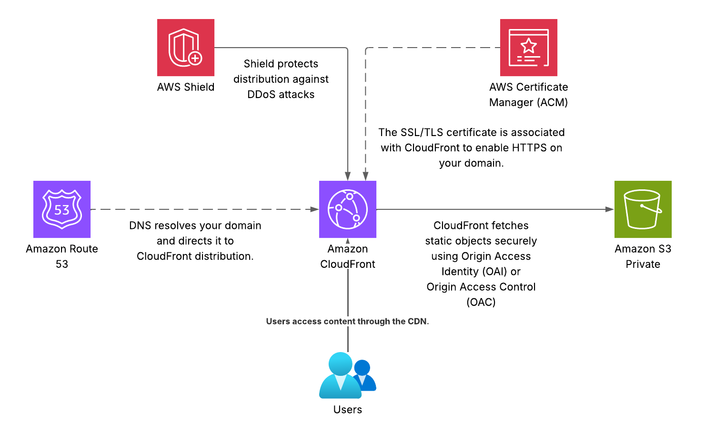

# 🌐 Terraform AWS: Deploy Aplicación Angular con Terraform en AWS

Este proyecto muestra cómo desplegar una aplicación Angular en **AWS**, utilizando **S3**, **CloudFront**, **ACM** y **Route53**, con infraestructura definida de manera modular en **Terraform**. Se incluye buenas prácticas como bloqueo de acceso público, uso de OAC (Origin Access Control) y certificados **ACM** para HTTPS.

--

## 🏗️ Arquitectura 
La infraestructura desplegada sigue el siguiente flujo:

1. **🗄️ S3 Bucket privado:** donde se almacena el build de Angular.
2. **🔒 ACM (Certificate Manager):** certificado SSL/TLS emitido en *us-east-1* y validado automáticamente vía DNS en Route53.
3. **☁️ CloudFront Distribution:**: entrega del contenido con HTTPS, index.html como default root, y manejo de errores para SPA (redirección 403/404 a index.html). Se configura **OAC** para que CloudFront acceda al bucket S3.
4. **🔑 Bucket Policy**: restringe el acceso al bucket únicamente a la distribución CloudFront específica.
5. **🌐 Route53 Record(alias):** vincula el dominio/subdominio con la distribución CloudFront.

## 📂 Estructura del proyecto

```bash
terraform-projects/
├─ providers.tf        # Configuración de proveedores AWS y alias us-east-1
├─ variables.tf        # Variables root
├─ main.tf             # Root module: instancia sub-módulos y "glue" (bucket policy, Route53 alias)
├─ outputs.tf          # Outputs root
└─ modules/
   ├─ s3_bucket/
   │  ├─ main.tf
   │  ├─ variables.tf
   │  └─ outputs.tf
   ├─ acm/
   │  ├─ main.tf
   │  ├─ variables.tf
   │  └─ outputs.tf
   └─ cloudfront/
      ├─ main.tf
      ├─ variables.tf
      └─ outputs.tf
```

## 📸 Arquitectura

### Arquitectura SERVERLESS implementada


## 🛠️ Prerrequisitos
* ✅ Terraform >= 1.5.0
* ✅ AWS CLI v2 autenticado
* ✅ Cuenta AWS con permisos: S3, CloudFront, ACM (us-east-1), Route53
* ✅ Hosted Zone pública creada en Route53 (ej. example.com)

## 🚀 Despliegue 
1. **Clonar el repositorio:**
	```bash
	git clone https://github.com/Junior-Jurado/terraform-projects.git
   	cd terraform-projects/s3-portafolio
	```

2. **Inicializar Terraform:**
	```bash
	terraform init
	```
3. **Planear despliegue:**
	```bash
	terraform plan \
		-var="domain_name=nombre-dominio-route53.com" \
		-out=tfplan
	```
4. **Aplicar despliegue:**
	```bash
	terraform apply "tfplan"
	```
5. **Aplicar despliegue:**
	```bash
	ng build --configuration production
	aws s3 sync ./dist/<app-name>/ s3://$(terraform -chdir=terraform output -raw bucket_name) --delete
	```
En el despliegue dejar en la raíz del proyecto el archivo index.html y assets

6. **Invalidar cache de CloudFront:**
	```bash
	DISTRIBUTION_ID=$(terraform -chdir=terraform output -raw cloudfront_id)
	aws cloudfront create-invalidation --distribution-id $DISTRIBUTION_ID --paths "/*"
	```

## 📝 Variables principales

| Variable           | Descripción                         | Ejemplo               |
|-------------------|------------------------------------|----------------------|
| `domain_name`      | Dominio raíz                        | germanjurado.com     |
| `subdomain`        | Subdominio (vacío para apex)        | www                  |
| `aws_region`       | Región para S3                      | us-east-1            |
| `project_name`     | Nombre del proyecto                 | portfolio            |

---

## 📊 Outputs

| Output                | Descripción                                           |
|-----------------------|------------------------------------------------------|
| `bucket_name`         | Nombre del bucket S3                                 |
| `cloudfront_domain`   | Dominio de la distribución CloudFront               |
| `cloudfront_id`       | ID de la distribución CloudFront                    |
| `site_url`            | URL completa de la app (`https://www.german-jurado.com`) |

---

## ✅ Buenas prácticas aplicadas

- 🔒 Bloqueo de acceso público y `OwnershipControls: BucketOwnerEnforced`  
- ☁️ OAC + Bucket Policy con `SourceArn` (acceso seguro desde CloudFront)  
- 🔐 ACM en `us-east-1` obligatorio para CloudFront  
- 🖥️ SPA-friendly: redirección 403/404 a `index.html`  
- 📦 Uso de módulos Terraform para mantener infraestructura modular y reusable  
- 🔄 `lifecycle { create_before_destroy = true }` para despliegues sin downtime  

---

## 💰 Costos estimados

- **S3**: almacenamiento del build  
- **CloudFront**: requests y transferencia de datos  
- **Route53**: registro de dominio y tráfico DNS  
- **ACM**: certificado gratuito  

> Revisar precios en la consola si esperas tráfico alto.
