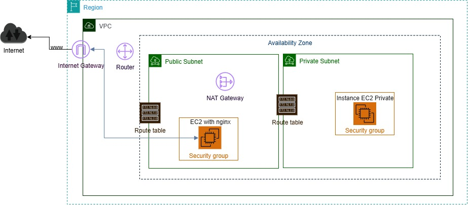
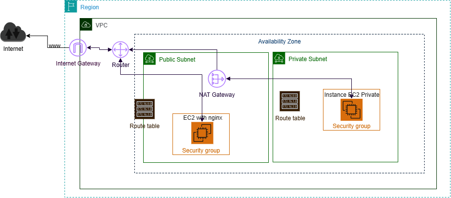

# 🌐 Terraform AWS: VPC + EC2 con Nginx  

Este proyecto implementa una infraestructura básica en **AWS** utilizando **Terraform**, siguiendo buenas prácticas de modularización y seguridad. El objetivo es sentar las bases de una arquitectura en la nube con conectividad pública y potencial de escalamiento hacia instancias privadas.  

--

## 📖 Descripción  

El despliegue incluye:
- **VPC personalizada**
- **Subnets públicas y privadas**
- **Internet Gateway(IGW)** y **Route Tables** para enrutamiento
- **Security Groups** con reglas de acceso seguras
- **EC2 pública con Nginx** instalada automaticamente vía *user data*

La infraestructura está diseñada para servir como **punto de partida** hacia arquitecturas más avanzadas (ej. instancias privadas con NAT Gateway, balanceadores, bases de datos, etc.).

---
## 📂 Estructura del proyecto

```bash
terraform-projects/
└── vpc-ec2/
    ├── main.tf              # Configuración principal
    ├── variables.tf         # Definición de variables
    ├── outputs.tf           # Resultados exportados (IP pública, etc.)
    ├── provider.tf          # Configuración del proveedor AWS
    ├── modules/
    │   ├── vpc/             # Módulo de la VPC, + subnets + route tables + IGW       
    │   ├── security-groups/ # Módulo de Security Groups
    │   └── ec2/             # Módulo de la instancia EC2 con Nginx
    └── README.md
```
---
## 🚀 Despliegue
1. **Clonar el repositorio:**
	```bash
	git clone https://github.com/Junior-Jurado/terraform-projects.git
   	cd terraform-projects/vpc-ec2
	```

2. **Inicializar Terraform:**
	```bash
	terraform init
	```
3. **Previsualizar los recursos:**
	```bash
	terraform plan
	```

4. **Aplicar los cambios:**
	```bash
	terraform apply -auto-approve
	```

## 🌍 Resultados
* Una EC2 pública con Nginx instalada y accesible mediante navegador.
* Salida principal desde Terraform:
	```hcl
	Ouputs:
	public_ec2_public_ip
	```
👉 Con esta IP podrás acceder a la página de bienvenida de Nginx.

## 📸 Arquitectura

### Versión 1 - implementada


### Versión 2 - Futuro (instancia privada + NAT Gateway)


## 🛠️ Tecnologías utilizadas
* Terraform
* AWS VPC
* Amazon EC2
* Nginx

## 📌 Próximos pasos
* Añadir instancia privada conectada vía NAT Gateway.
* Integrar balanceador de carga (ALB/ELB).
* Añadir soporte para base de datos RDS en subnet privada.